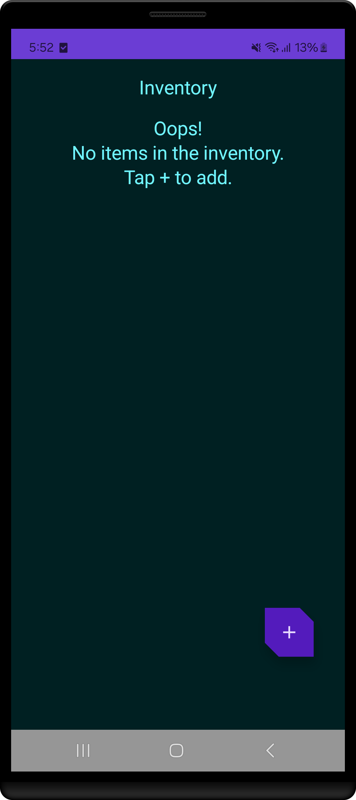
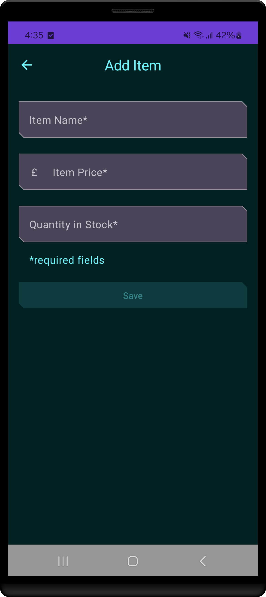
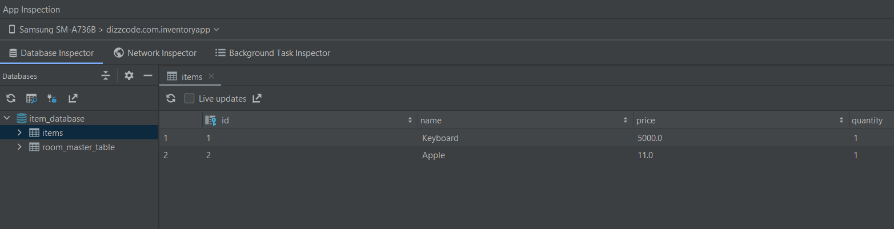

<h1 align="center" >  Inventory App  <br> [ ᴀɴᴅʀᴏɪᴅ ♾ ᴅᴇᴍᴏ ᴘʀᴏᴊᴇᴄᴛ ]</h1>

## ɪ  ⁃  ᴘʀᴏᴊᴇᴄᴛ ɪɴꜰᴏ

This app is an Inventory tracking app. Demos how to add, update, sell, and delete items from the local database.
This app demonstrated the use of Android Jetpack component [Room](https://developer.android.com/training/data-storage/room) database.
The app also leverages [ViewModel](https://developer.android.com/topic/libraries/architecture/viewmodel),
[Flow](https://developer.android.com/kotlin/flow),
and [Navigation](https://developer.android.com/topic/libraries/architecture/navigation/).

<br>

<div align="center">

⁃ ᴄᴏɴᴛᴇɴᴛꜱ ⁃  
[ᴜꜱᴇʀ ꜰᴇᴀᴛᴜʀᴇꜱ](#ɪɪ--ᴡʜᴀᴛ-ᴜꜱᴇʀꜱ-ᴄᴀɴ-ᴇxᴘᴇᴄᴛ)
| [ᴀᴘᴘ ꜱᴄʀᴇᴇɴꜱ](#ɪɪɪ--ᴠɪꜱᴜᴀʟ-ᴛᴏᴜʀ-ᴏꜰ-ᴛʜᴇ-ᴀᴘᴘ-ꜱᴄʀᴇᴇɴꜱ)
| [ᴘʀᴏᴊᴇᴄᴛ ʙʀᴀɴᴄʜᴇꜱ](#ɪᴠ--ᴘʀᴏᴊᴇᴄᴛ-ʙʀᴀɴᴄʜᴇꜱ)
| [ᴅᴇᴠ ꜰᴇᴀᴛᴜʀᴇꜱ](#ᴠ--ʙᴇʜɪɴᴅ-ᴛʜᴇ-ᴄᴏᴅᴇ-ᴅᴇᴠ-ꜰᴇᴀᴛᴜʀᴇꜱ)
| [ᴘʀᴏᴊᴇᴄᴛ ɴᴏᴛᴇꜱ](#ᴠɪ--ᴘʀᴏᴊᴇᴄᴛ-ɴᴏᴛᴇꜱ)

<br>
<br>

[](#)
[](#)

[](#)
[](#)
[](#)
[](#)

<br>
<br>


<br>

</div>


## ɪɪ ⁃ ᴡʜᴀᴛ ᴜꜱᴇʀꜱ ᴄᴀɴ ᴇxᴘᴇᴄᴛ

### ⭓ Features


1. Add Items
   - Users can add new inventory items to the local database.
   - The form may include fields like item name, quantity, price, description, etc.


2. Update Items
   - Users can update existing inventory details, such as modifying the quantity, name, or price of the item.
   

3. Delete Items
   - Users can delete items from the inventory entirely.


4. View Items List
   - Users can view all available items in a list, showing details like name, quantity, and price.


5. User-Friendly Interface
   - Simple and intuitive UI that allows users to interact with the inventory easily.


##
### ⭓ Requirements
- Android 7.0 and Above
- Min SDK version 24


##
### ⭓ Permissions
- N/A

<hr>

## ɪɪɪ ⁃ ᴠɪꜱᴜᴀʟ ᴛᴏᴜʀ ᴏꜰ ᴛʜᴇ ᴀᴘᴘ: ꜱᴄʀᴇᴇɴꜱ

<p align="center">



</p>


#
<div align="center">


  <br>

<kbd>[&nbsp; ⮝ &nbsp;  BACK TO TOP  &nbsp;&nbsp;&nbsp;](#ɪ----ᴘʀᴏᴊᴇᴄᴛ-ɪɴꜰᴏ) </kbd>
</div>

#
## ɪᴠ ⁃ ᴘʀᴏᴊᴇᴄᴛ ʙʀᴀɴᴄʜᴇꜱ

<!-- Main / Master / Production Branch -->

> <samp> **PRODUCTION BRANCH :**  </samp>  
> Stable code for deployment  
> ➲ [main][branch-main]

> <samp> **STAGING BRANCH :**  </samp>  
> `FLOW | Staging → Production`  
> For pre-release testing, which ensures that the code is stable, bug-free, and ready for deployment.  
> ➲ [staging][branch-staging]

> <samp> **DEVELOPMENT BRANCH :**  </samp>  
> `FLOW | Development → Release → Staging → Production`  
> Active codebase for ongoing development efforts  (New features, bug fixes, and improvements..)  
> ➲ [development][branch-development]


> <samp> **FEATURE BRANCHES :** N/A  </samp>  
> `FLOW | Feature → Development → Release → Staging → Production`  
<!-- 
> <samp> **FEATURE BRANCHES :**  </samp>  
> For Isolated feature development (Ensures changes are tested and reviewed before merging into the main workflow)  
>   
> feature/  
> ➲ dark-theme  
> ➲ offline-db-impl
-->


> <samp> **RELEASE BRANCHES :** N/A  </samp>  
> `FLOW | Release → Staging → Production`  
<!-- 
> <samp> **RELEASE BRANCHES :**  </samp>  
> Prepares the code for final testing and deployment in a new version release.
>   
> release/  
> ➲ version-number
-->


> <samp> **HOTFIX BRANCHES :** N/A  </samp>  
> `FLOW | Hotfix → Staging → Production`  
<!-- 
> <samp> **HOTFIX BRANCHES :**  </samp>  
> Handles critical fixes in production that need immediate resolution.
>   
> hotfix/  
> ➲ main-screen-crash 
-->


> <samp> **BUGFIX BRANCHES :** N/A  </samp>  
> `FLOW | Bugfix → Development → Release → Staging → Production` 
<!-- 
> <samp> **BUGFIX BRANCHES :**  </samp>  
> Addresses specific bugs identified during development and testing.
>   
> bugfix/  
> ➲ main-screen-error
-->

<!-- 
> <samp> **EXPERIMENTAL BRANCHES :** N/A  </samp>  

> <samp> **EXPERIMENTAL BRANCHES :**  </samp>  
> Facilitates trial and error to test new ideas and concepts.
>   
> experiment/  
> ➲ main-screen-change-colours
-->
<!-- Experimental → Feature → Development → Release → Staging → Main/Production   -->


[branch-main]:  https://github.com/dizzcode/inventory-android-test-app/tree/main
[branch-development]:  https://github.com/dizzcode/inventory-android-test-app/tree/development
[branch-staging]:  https://github.com/dizzcode/inventory-android-test-app/tree/staging

[branch-feature-NAME]:  https://github.com/dizzcode/inventory-android-test-app/tree/staging

[branch-hotfix-NAME]:  https://github.com/dizzcode/inventory-android-test-app/tree/staging

[branch-bugfix-NAME]:  https://github.com/dizzcode/inventory-android-test-app/tree/staging

<br>  

#
## ᴠ ⁃ ʙᴇʜɪɴᴅ ᴛʜᴇ ᴄᴏᴅᴇ: ᴅᴇᴠ ꜰᴇᴀᴛᴜʀᴇꜱ

### ⭓ App Dependencies/Libraries Overview

<br>

* [Kotlin][0] : Kotlin is statically typed & first-class language for Android Development.
* [Coroutines][1] : For Asynchronus or non-blocking operations.
* [Flows][2] : Data Streaming API which is built on top of Coroutines.
* [Jetpack Compose][3] : Toolkit for building native UI in a declarative way.
* [Room][4] : Save data in a local database using Room
* [Retrofit][5] : Type-safe REST client for Android to consume RESTful web services.
* [Dagger Hilt][6] : Dependency injection library for Android.
* [Kotlin DSL][7] : For writing gradle script for Kotlin is more readable and offers better compile-time.

[0]:  https://kotlinlang.org/
[1]:  https://kotlinlang.org/docs/coroutines-overview.html
[2]:  https://developer.android.com/kotlin/flow
[3]:  https://developer.android.com/jetpack/compose
[4]:  https://developer.android.com/training/data-storage/room
[5]:  https://github.com/square/retrofit
[6]:  https://dagger.dev/hilt/
[7]:  https://docs.gradle.org/current/userguide/kotlin_dsl.html


#
### ⭓ Features

1. Room Persistence Database Implementation &nbsp;|&nbsp;  [ More-> ](#1-room-persistence-database-implementation)  
    1.1 How to add Room library to the app  
    1.2 Create an item Entity  
    1.3 Create the item DAO  
    1.4 Create a Database instance  
    1.5 Implement the Repository  
    1.6 Implement AppContainer class  
    1.7 Add the save functionality  
    1.8 Add click listener to the Save button  


2. Read, Display, Update data with Room  &nbsp;|&nbsp;  [ More-> ](#2-read-display-update-data-with-room)  
    2.1 Update UI state  
    2.2 Emit UI state in the HomeViewModel  
    2.3 Display the Inventory data  


3. Test database &nbsp;|&nbsp;  [ More-> ](#3-test-database)

<br>
<br>  
<br>  

#
<div align="center">

<kbd>[&nbsp; ⮝ &nbsp;  BACK TO TOP  &nbsp;&nbsp;&nbsp;](#ɪ----ᴘʀᴏᴊᴇᴄᴛ-ɪɴꜰᴏ) </kbd>
</div>

#
# ᴠɪ ⁃ ᴘʀᴏᴊᴇᴄᴛ ɴᴏᴛᴇꜱ

<br> 

____

## 1. Room Persistence Database Implementation
Main components of Room
- `Room entities` represent tables in your app's database. You use them to update the data stored in rows in tables and to create new rows for insertion.
- Room `DAOs` provide methods that your app uses to retrieve, update, insert, and delete data in the database.
- Room `Database class` is the database class that provides your app with instances of the DAOs associated with that database.

<br>  

#
### 1.1 How to add Room library to the app
<br>

Add below dependencies | inside `build.gradle.kts` (Module :app)
```kotlin
//Room
implementation("androidx.room:room-runtime:${rootProject.extra["room_version"]}")
ksp("androidx.room:room-compiler:${rootProject.extra["room_version"]}")
implementation("androidx.room:room-ktx:${rootProject.extra["room_version"]}")
```

<br>  

#
### 1.2 Create an item **Entity**
- An Entity class defines a table, and each instance of this class represents a row in the database table.
- The `@Entity` annotation marks a class as a database Entity class.  
- For each Entity class, the app creates a database table to hold the items.  
- Each `field` of the Entity is represented as a `column` in the database
- Every entity instance stored in the database must have a `primary key`.
- After the app assigns a primary key, `it cannot be modified`; it represents the entity object as long as it exists in the database.

```kotlin
@Entity(tableName = "items")
class Item(
    @PrimaryKey(autoGenerate = true)
    val id: Int = 0,
    // ...
)
```
[ View Full Code --> ](./app/src/main/java/dizzcode/com/inventoryapp/data/Item.kt)

<br>  

#
### 1.3 Create the item **DAO**

- The Data Access Object (DAO) is a pattern you can use to separate the persistence layer from the rest of the application by providing an abstract interface

- The DAO you create is a custom interface that provides convenience methods for `querying/retrieving [@Query]`, `inserting [@Insert]`, `deleting [@Delete]`, and `updating [@Update]` the database. 
- Room generates an implementation of this class at `compile time`.

```kotlin
@Dao
interface ItemDao {

    @Insert(onConflict = OnConflictStrategy.IGNORE)
    suspend fun insert(item: Item)

    @Update
    suspend fun update(item: Item)

    @Delete
    suspend fun delete(item: Item)

    @Query("SELECT * from items WHERE id = :id")
    fun getItem(id: Int): Flow<Item>

    @Query("SELECT * from items " +
            "ORDER BY name ASC")
    fun getAllItems(): Flow<List<Item>>

}
```

[ View Full Code --> ](./app/src/main/java/dizzcode/com/inventoryapp/data/ItemDao.kt)

<br>  

> [!NOTE]  
> @Insert(onConflict = OnConflictStrategy.IGNORE)
>
> `NONE` : OnConflict strategy constant used by [default] when no other strategy is set.  
> `IGNORE` : OnConflict strategy constant to ignore the conflict.  
> `REPLACE` : OnConflict strategy constant to replace the old data and continue the transaction.  
> `ABORT` : OnConflict strategy constant to abort the transaction.

<br>  

#
### 1.4 Create a **Database instance**

- The `Database` class provides your app with instances of the DAOs you define.
- You need to create an abstract RoomDatabase class and annotate it with `@Database`

```kotlin
@Database(
    entities = [Item::class],
    version = 1,
    exportSchema = false
)
abstract class InventoryDatabase : RoomDatabase() {

    abstract fun itemDao(): ItemDao

    companion object {
        @Volatile
        private var Instance: InventoryDatabase? = null

        fun getDatabase(context: Context): InventoryDatabase {
            return Instance ?: synchronized(this) {
                Room.databaseBuilder(
                    context,
                    InventoryDatabase::class.java,
                    "item_database"
                )
                    .fallbackToDestructiveMigration()
                    .build()
                    .also { Instance = it }
            }
        }
    }
}
```

[ View Full Code --> ](./app/src/main/java/dizzcode/com/inventoryapp/data/InventoryDatabase.kt)

<br>  

> @Database ( entities = [Item::class], version = 1, exportSchema = false )

- Specify the Item as the only class with the list of `entities`.
- Set the version as `1`. Whenever you change the schema of the database table, you have to `increase the version number`.
- Set `exportSchema` to `false` so as not to keep schema version history backups.

<br> 

[Understanding migrations with Room](https://medium.com/androiddevelopers/understanding-migrations-with-room-f01e04b07929)

<br>  

<br>  

#
### 1.5 Implement the Repository

Implement the **ItemsRepository** interface and **OfflineItemsRepository** class to provide `get, insert, delete, and update` entities from the database.

> Items`Repository`

```kotlin
interface ItemsRepository {
    
    fun getItemStream(id: Int): Flow<Item?>

    suspend fun insertItem(item: Item)

    suspend fun deleteItem(item: Item)

    suspend fun updateItem(item: Item)
    
    // ...
}
```

[ View Full Code --> ](./app/src/main/java/dizzcode/com/inventoryapp/data/ItemsRepository.kt)

<br>

> `Offline`Items`Repository`

```kotlin
class OfflineItemsRepository(
    private val itemDao : ItemDao
) : ItemsRepository {

    override fun getAllItemsStream(): Flow<List<Item>> = itemDao.getAllItems()

    override fun getItemStream(id: Int): Flow<Item?> = itemDao.getItem(id = id)

    override suspend fun insertItem(item: Item) = itemDao.insert(item = item)

    override suspend fun deleteItem(item: Item) = itemDao.delete(item = item)

    override suspend fun updateItem(item: Item) = itemDao.update(item = item)
}
```

[ View Full Code --> ](./app/src/main/java/dizzcode/com/inventoryapp/data/OfflineItemsRepository.kt)

<br>  

#
### 1.6 Implement AppContainer class

- App container for Dependency injection.
- **AppContainer** implementation that provides instance of **OfflineItemsRepository**

```kotlin

interface AppContainer {
    val itemsRepository: ItemsRepository
}


class AppDataContainer(private val context: Context) : AppContainer {
 
    override val itemsRepository: ItemsRepository by lazy {
        OfflineItemsRepository(
            InventoryDatabase.getDatabase(context = context).itemDao()
        )
    }
}
```

[ View Full Code --> ](./app/src/main/java/dizzcode/com/inventoryapp/data/AppContainer.kt)

<br>

#
### 1.7 Add the save functionality

- To save the app's transient data and to also access the database, you need to update the ViewModels. 
- Your ViewModels interact with the database via the DAO and provide data to the UI. 
- All database operations need to be run away from the main UI thread; you do so with coroutines and `viewModelScope`.

<br>

- Open the `ItemEntry`ViewModel class and add a private default constructor parameter of the type `ItemsRepository`.

```kotlin
class ItemEntryViewModel(
    private val itemsRepository: ItemsRepository
) : ViewModel() {
    // ...
}
```
[ View Full Code --> ](./app/src/main/java/dizzcode/com/inventoryapp/ui/item/ItemEntryViewModel.kt)

<br>

- Update the initializer for the item entry view model in the `AppViewModelProvider.kt` and pass in the repository instance as a parameter.

```kotlin
object AppViewModelProvider {
    val Factory = viewModelFactory {
        // Other Initializers 
        initializer {
            ItemEntryViewModel(
                inventoryApplication().container.itemsRepository
            )
        }
        //...
    }
}
```
[ View Full Code --> ](./app/src/main/java/dizzcode/com/inventoryapp/ui/AppViewModelProvider.kt)

<br>

- In the `ViewModel` class and add a suspend function called `saveItem()` to insert an item into the Room database. 
- This function adds the data to the database in a non-blocking way.

```kotlin
suspend fun saveItem() {
    if (validateInput()) {
        itemsRepository.insertItem(
            item = itemUiState.itemDetails.toItem()
        )
    }
}
```
[ View Full Code --> ](./app/src/main/java/dizzcode/com/inventoryapp/ui/item/ItemEntryViewModel.kt)

<br>  

#
### 1.8 Add click listener to the Save button

- To tie everything together, add a click handler to the Save(Item Add) button. 
- Inside the click handler, you launch a coroutine and call `saveItem()` to save the data in the Room database.

<br>

-  inside the *Screen* composable function, create a val named coroutineScope with the rememberCoroutineScope() composable function.

> [!NOTE]  
> rememberCoroutineScope()  
> 
> The rememberCoroutineScope() is a composable function that returns a CoroutineScope bound to the composition where it's called.  
> You can use the rememberCoroutineScope() composable function when you want to launch a coroutine outside of a composable and  
> ensure the coroutine is canceled after the scope leaves the composition. You can use this function when you need to control  
> the lifecycle of coroutines manually, for example, to cancel an animation whenever a user event happens.
>


```kotlin
val coroutineScope = rememberCoroutineScope()

// ...
ItemEntryBody(
    // ...
    onSaveClick = {
        coroutineScope.launch {
            viewModel.saveItem()
        }
    },
    //...
)

```
[ View Full Code --> ](./app/src/main/java/dizzcode/com/inventoryapp/ui/item/ItemEntryScreen.kt)

<br>

#### View the database content using Database Inspector

> [!NOTE]  
> The Database Inspector only works with the SQLite library included in the   
> Android operating system on API level 26 and higher. It doesn't work with other   
> SQLite libraries that you bundle with your app.
>

<p align="center">
    
</p>

#

<kbd>[&nbsp; ► &nbsp;  BACK TO Project Notes  &nbsp;&nbsp;&nbsp;](#ᴠɪ--ᴘʀᴏᴊᴇᴄᴛ-ɴᴏᴛᴇꜱ) </kbd>

____

<br>  

#
## 2. Read and Display data with Room

<br>

In this task, you add a `LazyColumn` to the app to display the data stored in the database.

To pass the inventory list to this composable, you must retrieve the inventory data from the repository and pass it into the HomeViewModel

#
### 2.1 Update UI state

- When you added methods to ItemDao to get items- getItem() and getAllItems()- you specified a Flow as the return type.


- By returning a Flow in getItem() and getAllItems(), you allow Room to handle data updates asynchronously. This way, the DAO methods are called once, and any changes to the data are automatically observed without needing additional calls during the lifecycle.


- Getting data from a flow is called collecting from a flow. When collecting from a flow in your UI layer, there are a few things to consider.

  - Recompositions: Events like device rotation recreate the activity, causing the Flow to be collected again.
  - Caching: Cache values as state to retain data across lifecycle events.
  - Cancellation: Cancel the Flow when there are no observers, such as when a composable's lifecycle ends.


> [!IMPORTANT]  
> The recommended way to expose a `Flow` from a `ViewModel` is with a `StateFlow`
> 
> Using a StateFlow allows the data to be saved and observed, regardless of the UI lifecycle.  
> To convert a Flow to a StateFlow, you use the stateIn operator.


- The stateIn operator has three parameters which are explained below:

  - `scope` - The viewModelScope defines the lifecycle of the StateFlow. When the viewModelScope is canceled, the StateFlow is also canceled.
  - `started` - The pipeline should only be active when the UI is visible. The SharingStarted.WhileSubscribed() is used to accomplish this. To configure a delay (in milliseconds) between the disappearance of the last subscriber and the stopping of the sharing coroutine, pass in the TIMEOUT_MILLIS to the SharingStarted.WhileSubscribed() method.
  - `initialValue` - Set the initial value of the state flow to HomeUiState().


- Once you've converted your Flow into a `StateFlow`, you can collect it using the `collectAsState()` method, converting its data into State of the same type.

*In this step, you'll retrieve all items in the Room database as a StateFlow observable API for UI state. When the Room Inventory data changes, the UI updates automatically.*

> Initial code

```kotlin
class HomeViewModel : ViewModel() {
    companion object {
        private const val TIMEOUT_MILLIS = 5_000L
    }
}

data class HomeUiState(val itemList: List<Item> = listOf())

```

<br>

#
### 2.2 Emit UI state in the HomeViewModel

```kotlin
class HomeViewModel(
    itemsRepository: ItemsRepository //Added
) : ViewModel() {

    // ------ Added
    val homeUiState: StateFlow<HomeUiState> =
        itemsRepository.getAllItemsStream().map { item ->
            HomeUiState(item)
        }.stateIn(
            scope = viewModelScope,
            started = SharingStarted.WhileSubscribed(TIMEOUT_MILLIS),
            initialValue = HomeUiState()
        )
    // ------ Added

    companion object {
        private const val TIMEOUT_MILLIS = 5_000L
    }
}


data class HomeUiState(val itemList: List<Item> = listOf())
```
[ View Full Code --> ](./app/src/main/java/dizzcode/com/inventoryapp/ui/home/HomeViewModel.kt)

<br>

```kotlin
object AppViewModelProvider {
    val Factory = viewModelFactory {
        // Other Initializers 
        initializer {
            HomeViewModel(
                inventoryApplication().container.itemsRepository
            )
        }
        //...
    }
}
```
[ View Full Code --> ](./app/src/main/java/dizzcode/com/inventoryapp/ui/AppViewModelProvider.kt)

<br>

#
### 2.3 Display the Inventory data

In this task, you collect and update the UI state in the HomeScreen.


> Initial code

```kotlin
@Composable
fun HomeScreen(
    navigateToItemEntry: () -> Unit,
    navigateToItemUpdate: (Int) -> Unit,
    modifier: Modifier = Modifier
) {
    // ...
}
```

<br>

> Modified Code

```kotlin
@Composable
fun HomeScreen(
    navigateToItemEntry: () -> Unit,
    navigateToItemUpdate: (Int) -> Unit,
    modifier: Modifier = Modifier,
    viewModel: HomeViewModel = viewModel(factory = AppViewModelProvider.Factory) // Added
){
    // ..
    val homeUiState by viewModel.homeUiState.collectAsState()
    // ...

    HomeBody(
        itemList = homeUiState.itemList, //Added
        onItemClick = navigateToItemUpdate,
        modifier = modifier.padding(innerPadding)
    )
}
```
[ View Full Code --> ](./app/src/main/java/dizzcode/com/inventoryapp/ui/home/HomeScreen.kt)

<br>

#
### 2.4 Display item details

In this task, you read and display the entity details on the Item Details screen.

> Initial code

```kotlin
@Composable
fun ItemDetailsScreen(
    navigateToEditItem: (Int) -> Unit,
    navigateBack: () -> Unit,
    modifier: Modifier = Modifier
) {
    // ...
}
```

<br>

> Modified Code : ItemDetailsScreen

```kotlin
@Composable
fun ItemDetailsScreen(
    navigateToEditItem: (Int) -> Unit,
    navigateBack: () -> Unit,
    viewModel: ItemDetailsViewModel = viewModel(factory = AppViewModelProvider.Factory), //Added
    modifier: Modifier = Modifier
) {
    val uiState = viewModel.uiState.collectAsState() //Added
    
    // ...
    ItemDetailsBody(
        itemDetailsUiState = uiState.value, //Added
        onSellItem = { },
        onDelete = { },
        // ...
    )
}
```
[ View Full Code --> ](./app/src/main/java/dizzcode/com/inventoryapp/ui/item/ItemDetailsScreen.kt)

<br>

> Modified Code : ItemDetailsViewModel
```kotlin
class ItemDetailsViewModel(
    savedStateHandle: SavedStateHandle,
    private val itemsRepository: ItemsRepository //Added
) : ViewModel() {

    // ---- Added
    val uiState: StateFlow<ItemDetailsUiState> =
        itemsRepository.getItemStream(itemId)
            .filterNotNull()
            .map { item ->
                ItemDetailsUiState(itemDetails = item.toItemDetails())
            }.stateIn(
                scope = viewModelScope,
                started = SharingStarted.WhileSubscribed(TIMEOUT_MILLIS),
                initialValue = ItemDetailsUiState()
            )
    // ---- Added
}
```

<br>

> Modified Code : AppViewModelProvider
```kotlin
initializer {
    ItemDetailsViewModel(
        this.createSavedStateHandle(),
        inventoryApplication().container.itemsRepository //Added
    )
}
```

<br>

#

<kbd>[&nbsp; ► &nbsp;  BACK TO Project Notes  &nbsp;&nbsp;&nbsp;](#ᴠɪ--ᴘʀᴏᴊᴇᴄᴛ-ɴᴏᴛᴇꜱ) </kbd>

____

<br>  


#
## 3 Implement sell item

This update involves the following tasks:

- Add a test for the DAO function to update an entity.
- Add a function in the ItemDetailsViewModel to reduce the quantity and update the entity in the app database.
- Disable the Sell button if the quantity is zero.

#
### 3.1 Add a function in the ViewModel

> [!IMPORTANT]  
> viewModelScope.launch{}
> 
> You must run database operations inside a coroutine.

```kotlin
class ItemDetailsViewModel(
    savedStateHandle: SavedStateHandle,
    private val itemsRepository: ItemsRepository
) : ViewModel() {
    // ...
    val uiState: StateFlow<ItemDetailsUiState> =
        itemsRepository.getItemStream(itemId)
            .filterNotNull()
            .map { item ->
                ItemDetailsUiState(
                    outOfStock = item.quantity <= 0, // Added
                    itemDetails = item.toItemDetails()
                )
            }
    // ...
    
    // ----- Added
    fun reduceQuantityByOne() {
        viewModelScope.launch {

            val currentItem = uiState.value.itemDetails.toItem()

            if (currentItem.quantity > 0) {
                itemsRepository.updateItem(
                    currentItem.copy(quantity = currentItem.quantity - 1)
                )
            }
        }
    }
    // ----- Added
}
```
[ View Full Code --> ](./app/src/main/java/dizzcode/com/inventoryapp/ui/item/ItemDetailsViewModel.kt)

```kotlin
@Composable
fun ItemDetailsScreen() {
    // ...
    ItemDetailsBody(
        itemUiState = uiState.value,
        onSellItem = { viewModel.reduceQuantityByOne() }, //Added
        onDelete = { },
        // ...
    )
}
```

<br>

#

<kbd>[&nbsp; ► &nbsp;  BACK TO Project Notes  &nbsp;&nbsp;&nbsp;](#ᴠɪ--ᴘʀᴏᴊᴇᴄᴛ-ɴᴏᴛᴇꜱ) </kbd>

____

<br>  

#
## 4 Delete item entity


<br>

#

<kbd>[&nbsp; ► &nbsp;  BACK TO Project Notes  &nbsp;&nbsp;&nbsp;](#ᴠɪ--ᴘʀᴏᴊᴇᴄᴛ-ɴᴏᴛᴇꜱ) </kbd>

____

<br>  

#
## 5 Edit/Update data with Room


<br>

#

<kbd>[&nbsp; ► &nbsp;  BACK TO Project Notes  &nbsp;&nbsp;&nbsp;](#ᴠɪ--ᴘʀᴏᴊᴇᴄᴛ-ɴᴏᴛᴇꜱ) </kbd>

____

<br>  

#
## 6. Test database

In this task, you add some unit tests to test your DAO queries, and then you add more tests as you progress through the codelab.

<br>

Add below dependencies | inside `build.gradle.kts` (Module :app)

```kotlin
// Testing
androidTestImplementation("androidx.test.espresso:espresso-core:3.5.1")
androidTestImplementation("androidx.test.ext:junit:1.1.5")
```
<br>

#
### 6.1 Test Add Items

 **Directory : androidTest/kotlin**

> Full Code
```kotlin
@RunWith(AndroidJUnit4::class)
class ItemDaoTest {

    private lateinit var itemDao: ItemDao
    private lateinit var inventoryDatabase: InventoryDatabase

    private var item1 = Item(1, "Apples", 10.0, 20)
    private var item2 = Item(2, "Bananas", 15.0, 97)

    @Before
    fun createDb() {
        val context: Context = ApplicationProvider.getApplicationContext()
        // Using an in-memory database because the information stored here disappears when the
        // process is killed.
        inventoryDatabase = Room.inMemoryDatabaseBuilder(context, InventoryDatabase::class.java)
            // Allowing main thread queries, just for testing.
            .allowMainThreadQueries()
            .build()
        itemDao = inventoryDatabase.itemDao()
    }

    @After
    @Throws(IOException::class)
    fun closeDb() {
        inventoryDatabase.close()
    }

    // ----------

    private suspend fun addOneItemToDb() {
        itemDao.insert(item1)
    }

    @Test
    @Throws(Exception::class)
    fun daoInsert_insertsItemIntoDB() = runBlocking {
        addOneItemToDb()

        val allItems = itemDao.getAllItems().first()

        assertEquals(allItems[0], item1)
    }

    // ----------

    private suspend fun addTwoItemsToDb() {
        itemDao.insert(item1)
        itemDao.insert(item2)
    }

    @Test
    @Throws(Exception::class)
    fun daoGetAllItems_returnsAllItemsFromDB() = runBlocking {
        addTwoItemsToDb()

        val allItems = itemDao.getAllItems().first()
        assertEquals(allItems[0], item1)
        assertEquals(allItems[1], item2)
    }
}
```
[ View Full Code --> ](./app/src/androidTest/kotlin/ItemDaoTest.kt)

- `@Before` so that it can run before every test.
- `@After` to close the database and run after every test.
- add `suspend` so they can run in a coroutine.
- You run the test in a new coroutine with `runBlocking{}`. This setup is the reason you mark the utility functions as suspend


#
### 6.2 Test Edit Items

```kotlin
    @Test
@Throws(Exception::class)
fun daoUpdateItems_updatesItemsInDB() = runBlocking {
        addTwoItemsToDb()

        itemDao.update(Item(1, "Apples", 15.0, 25))
        itemDao.update(Item(2, "Bananas", 5.0, 50))

        val allItems = itemDao.getAllItems().first()
        assertEquals(allItems[0], Item(1, "Apples", 15.0, 25))
        assertEquals(allItems[1], Item(2, "Bananas", 5.0, 50))
}
```
[ View Full Code --> ](./app/src/androidTest/kotlin/ItemDaoTest.kt)

<br>

#
### 6.2 Test Delete Items

#

<kbd>[&nbsp; ► &nbsp;  BACK TO Project Notes  &nbsp;&nbsp;&nbsp;](#ᴠɪ--ᴘʀᴏᴊᴇᴄᴛ-ɴᴏᴛᴇꜱ) </kbd>

____


<br>

<hr>
<div align="center">

<kbd>[&nbsp; ⮝ &nbsp;  BACK TO TOP  &nbsp;&nbsp;&nbsp;](#ɪ----ᴘʀᴏᴊᴇᴄᴛ-ɪɴꜰᴏ) </kbd>
</div>
<hr>
<br>
